# Linux Fundamentals with Vagrant

## Objective
This project demonstrates basic Linux system administration tasks using Vagrant. It covers setting up a Vagrant Server, exploring the Linux file system, managing permissions, installing packages, and testing network connectivity.

---

## Task 1: Create a GitHub Repository
I created a public GitHub repository named `linux-fundamentals-vagrant` with a README.md file.

- Github Repository URL - [linux-fundamentals-vagrant](https://github.com/wilfredoamen/linux-fundamentals-vagrant-.git)

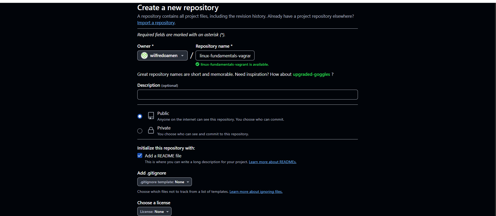
*Screenshot 1a: Shows the process of creating a github repository where i named my repository linux-fundamentals-vagrant.*

---

## Task 2: Set Up a Vagrant Server

### Part A: Install Vagrant
1. Downloaded and installed Vagrant from [vagrantup.com](https://www.vagrantup.com/)
2. Verified installation with `vagrant --version` on my windows powershell.

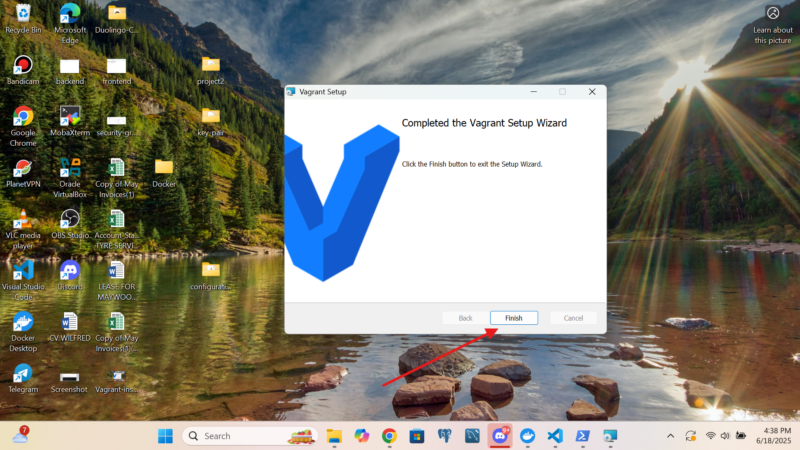 

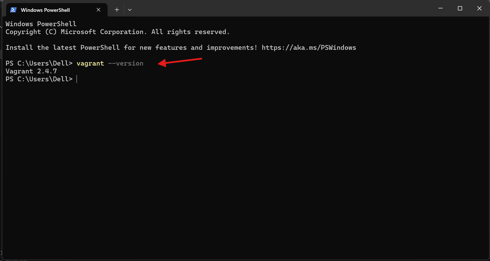
*Screenshot 2a & 2b: Shows successful Vagrant installation and version confirmation.To install Vagrant, I first downloaded the appropriate installer for my operating system from the official Vagrant website.
 Run the installer and follow the on-screen instructions to complete the setup. Once installed, open a terminal or command prompt and verify the installation by running vagrant --version. This command will display the installed version, confirming that Vagrant is ready to use.*

### Part B: Set Up Vagrant Server
1. First,downloads the Ubuntu(Focal Fossa) base image from Vagrant's public box repository with`vagrant box add ubuntu/focal64`.  
   *This is a one-time download that can be reused multiple projects.*

2. Initialize a new Ubuntu VM with `vagrant init ubuntu/focal64`. These creates a new `Vagrantfile` configuration using the downloaded Ubuntu image.  
   *This file defines our VM's settings (CPU, memory, networking, etc.) and can be customized.*
3. Install the VBGuest plugin with `vagrant plugin install vagrant-vbguest`. These automatically manages VirtualBox Guest Additions.  
   *It ensures proper synchronization between host and guest OS, especially for shared folders.*
3. Starts the VM with `vagrant up`. These creates and starts the virtual machine based on the Vagrantfile configuration.  
   
   *It performs these actions:*
   - Allocates system resources
   - Boots the Ubuntu OS
   - Configures networking
   - Sets up shared folders
   - Runs any provisioning scripts

4. Connected via SSH with `vagrant ssh`. These establish an SSH connection to the running virtual machine.  
   *Provides direct terminal access to the Ubuntu environment as the 'vagrant' user.

**Execution Screenshots:**

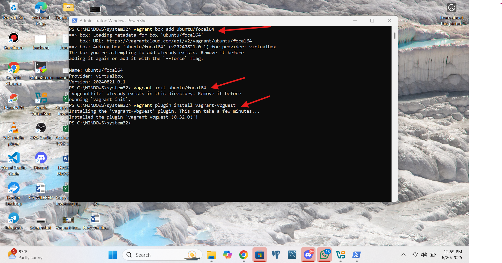  
*Screenshot 3a: Downloading the Ubuntu 20.04 base box, Initializing new Vagrant environment and Installing the VBGuest plugin*

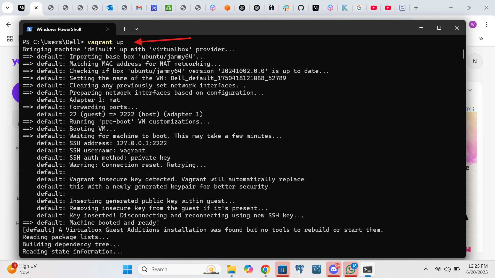  
*Screenshot 3b: Starting the virtual machine*

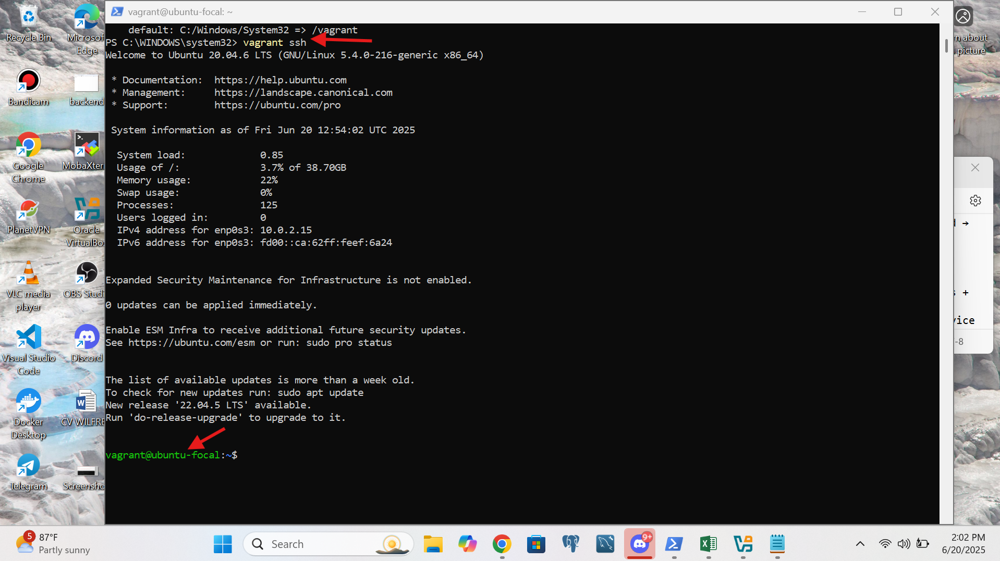  
*Screenshot 3c: Successful SSH connection to the VM*

As showned in the screenshots above, i started by downloading the Ubuntu 20.04 base box by running vagrant box add ubuntu/focal64, which fetches the official image from HashiCorp’s catalog. Next, initialize a new Vagrant environment with vagrant init ubuntu/focal64, creating a Vagrantfile to configure my VM. Then, install the VBGuest plugin using vagrant plugin install vagrant-vbguest to ensure VirtualBox Guest Additions stay updated. Finally, start the VM with vagrant up and access it via SSH by running vagrant ssh, logging you into the Ubuntu machine.

---

## Task 3: Explore the Linux File System
I created a custom folder structure with **`mkdir -p /home/vagrant/projects/devops`** command.
The command `mkdir -p /home/vagrant/projects/devops` creates the directory devops and any missing parent directories (projects/)
in the specified path, ensuring the full folder structure exists without errors. The -p flag prevents failures if parts of the path already exist.

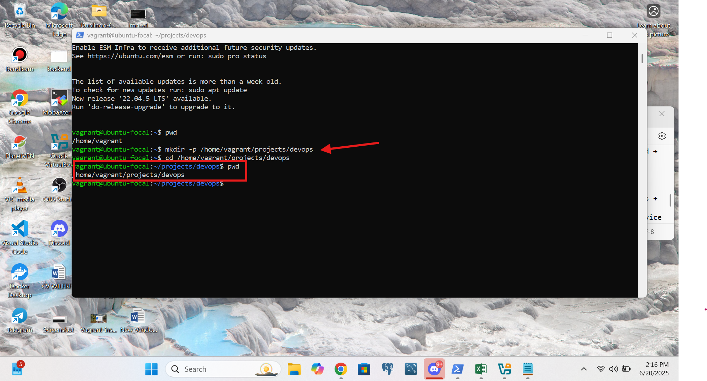  
*Screenshot 4a: Showing a successful directory creation using the command **cd** the navigate into the directory **~/Devops** and **pwd** to show the present working directory.*

As seen above, i created a custom folder structure by running mkdir -p /home/vagrant/projects/devops, which recursively builds the projects/devops directory under /home/vagrant. I then navigated into the ~/Devops directory using cd ~/Devops, changing my working directory. Finally, i confirmed my location by running pwd (Print Working Directory), which displayed the full path (/home/vagrant/Devops), verifying that you were inside the correct directory.

---

## Task 4: Manage File Permissions and Ownership
- I Created a dev-test.txt file and modified its permissions and ownership.

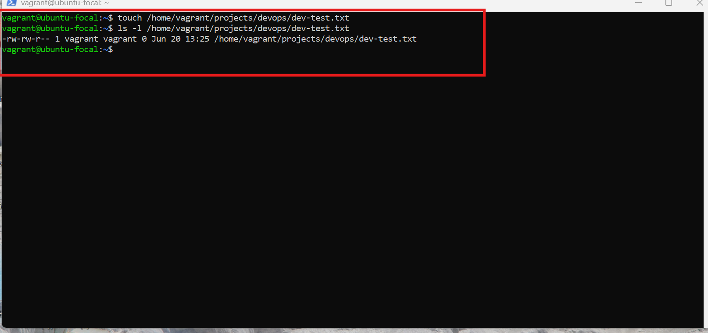  
*Screenshot 5a: I used `touch /home/vagrant/project/devops/dev-test.txt` to create a `dev-test.txt` file.*

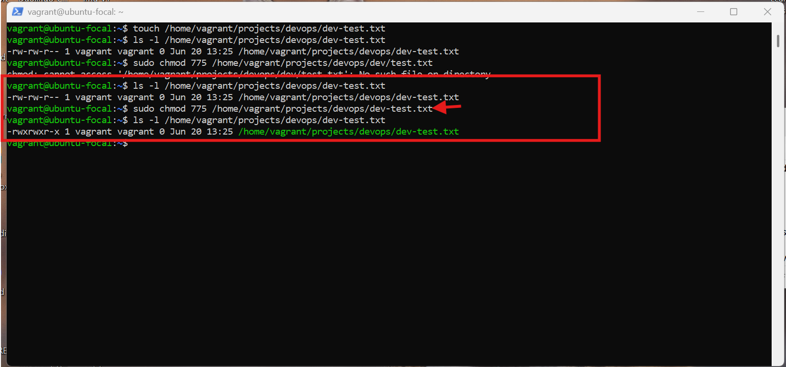  
*Screenshot 5b: I used `chmod 775 dev-test.txt` to set permissions to `-rwxrwxr-x` (Owner: read/write/execute, Group: read/write/execute, Others: read/execute)*

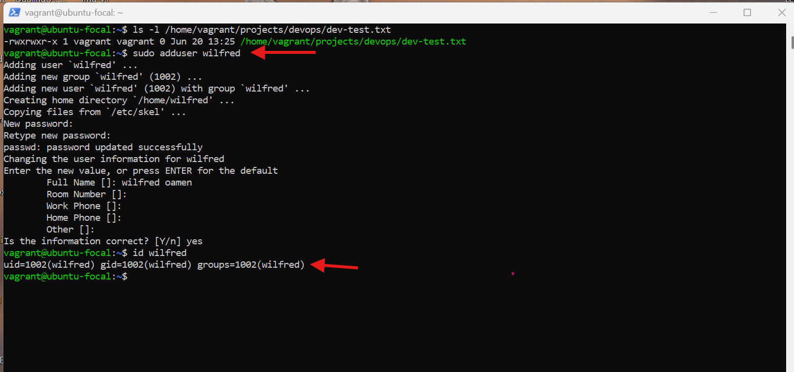 
*Screenshot 5c: Before changing the file ownership,i first added a user with `useradd` command.* 

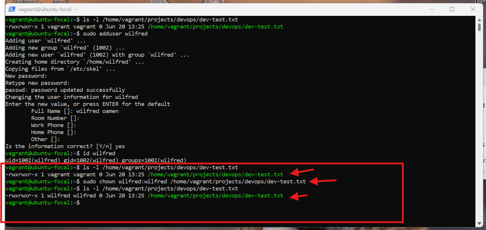 
*Screenshot 5d : Now that i have a user i used `chown wilfred:wilfred dev-test.txt` to set owner/group to 'wilfred'*

I created a file named dev-test.txt inside /home/vagrant/project/devops/ using the `touch` command, which initializes an empty file. To control access, i modified its permissions with `chmod 775 dev-test.txt`, granting the owner and group full read, write, and execute (rwx) privileges, while others were given only read and execute (r-x) access. Before changing ownership, i added a new user named wilfred using the `useradd` command, ensuring the user existed in the system. Finally, i then assigned ownership of the file to wilfred with `sudo chown wilfred:wilfred dev-test.txt`, making this user both the owner and group owner of the file. This configuration ensures that wilfred has full control over the file, while group members share the same permissions, and other users can only read or execute it.

---

## Task 5: Install and Configure a Package
I Installed the `tree` package.

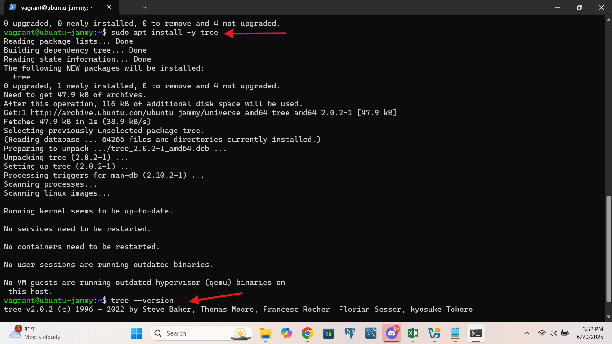  
*Screenshot 6a: Shows `sudo apt install -y tree` and version confirmation with `tree --version`.*

I installed the tree utility using the command `sudo apt install -y tree`, which downloads and sets up the package on your Ubuntu system in a non-interactive way (thanks to the -y flag automatically confirming prompts). The tree command is a useful tool for visually displaying directory structures in a hierarchical tree format, making it easier to navigate and understand folder layouts. After installation, i verified the installed version by running tree --version, which outputs the current version number, confirming that the tool is ready for use

---

## Task 6: Test Remote Connectivity
I Tested connection to google.com using ping.

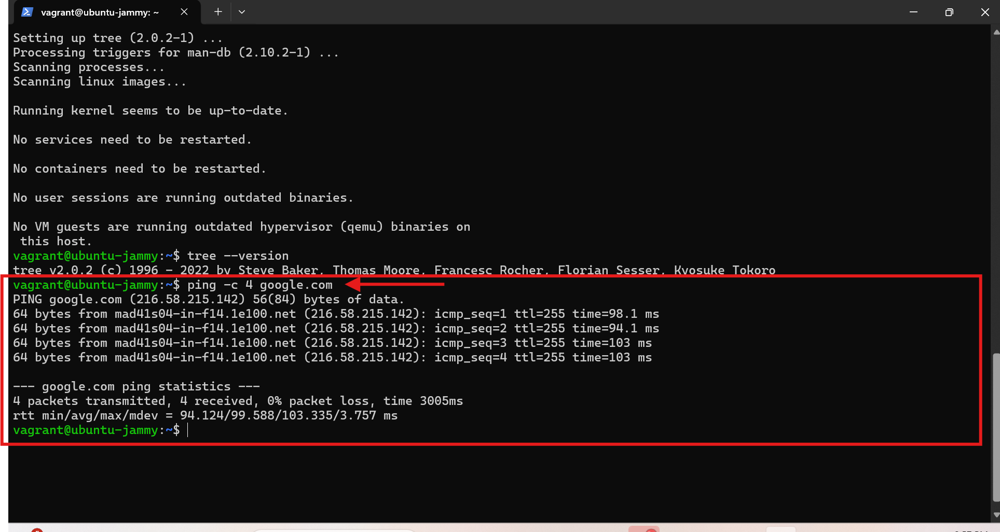  
*Screenshot 7a: Successful ping output shows:*
- Network connectivity is working
- Round-trip time statistics
- Confirms DNS resolution is functioning

---

---